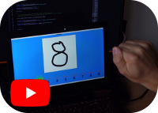
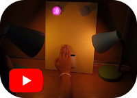
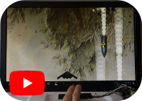
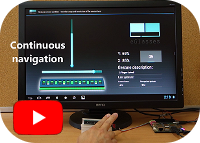
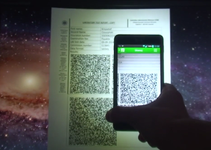
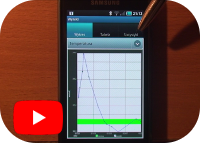

# Multimedia
Links to some of my research project videos

| Link | Description |
| --- | --- |
|  | **Digit wizard** PC app for drawing digits in the air utilizing the Intel RealSense F200 camera. Digits are recognized by a CNN model built with Keras and the inference is done thanks to the TensorFlowSharp. For **GitHub repo** of the project click [here](https://github.com/ChrisQlasty/DigitWizard). |
|  | **Smart lights** PC app for controlling Philips HUE lamps utilizing touchless gesture sensor. For **GitHub repo** of the project click [here](https://github.com/ChrisQlasty/RideTheLamps). |
|  | **Clip for UbiComp '16** - movie, which was assisting the demonstration stand, with the gesture sensor connected to Odroid-X SBC. It was related with the paper titled _["Semi complex navigation with an active optical gesture sensor"](https://dl.acm.org/citation.cfm?id=2971375)_. |
|  | **Demo app at UbiComp '16** - Android application, which was an interactive part of the demonstration stand at the conference demo session. Touchless gesture sensor was connected to Odroid-X SBC.|
|  | **LabSeq** Android app for secure exchange of patient laboratory data. It was presented at **Human System Interactions 2014** conference with the paper titled _["Interaction with medical data using QR-codes"](https://ieeexplore.ieee.org/abstract/document/6860471)_. |
|  | **eDoctor** - Android application made at studies for doctors to have quick access to data of hospitalized patients. It was developed into LabSeq app mentioned above. |
