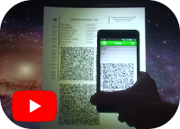

# Multimedia
Links to some of my research project videos

| Description | Link |
| --- | --- |
| **LabSeq** Android app for secure exchange of patient laboratory data. It was presented at **Human System Interactions 2014** conference with the paper titled _["Interaction with medical data using QR-codes"](https://ieeexplore.ieee.org/abstract/document/6860471)_ |  |
| **eDoctor** - Android application made at studies for doctors to have quick access to data of hospitalized patients. It was developed into LabSeq app mentioned above. |  |
